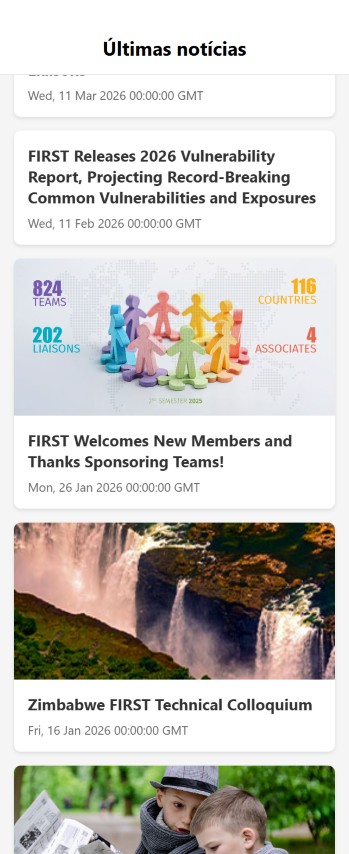

# 📝 Desafio Prático: Refatorando o App de Notícias

Seja bem-vindo(a) ao desafio de React Native! O objetivo desta atividade é permitir que você pratique habilidades cruciais no desenvolvimento mobile melhorando o aplicativo de notícias existente.

## 🎯 Tópicos Abordados

Neste exercício, você terá contato direto com os seguintes componentes nativos do React Native:

- **Básicos:** `View`, `ScrollView` e `Text`
- **Interativos e Estilização:** `TextInput`, `Image`, `Button` e `StyleSheet`
- **Listas de Alta Performance:** `FlatList` e `SectionList`

---

## 🚀 Passo a Passo das Notícias

Abaixo estão os requisitos para você implementar e melhorar no código existente.

### 1. Refatorando a Lista de Notícias (FlatList / SectionList)
Atualmente, a tela principal (`App.tsx`) exibe as notícias percorrendo um *array* usando `map()` dentro de um componente `ScrollView`. Isso não é ideal para listas longas, pois gasta muita memória.

- **🎯 Objetivo:** Altere as listas para usarem os componentes inteligentes e nativos.
- **Crie um componente `<NewsItem />`**: Extraia a lógica visual individual de uma notícia (atualmente no componente `<News />`) para servir de renderizador para cada item.
- **Crie um componente `<NewsList />`**: Ele será responsável por conter a lista inteira.
- **Implemente a `<FlatList />`**: Utilize a `FlatList` no lugar da `ScrollView`. Passe seu array de notícias na propriedade `data` e passe seu novo `<NewsItem />` na propriedade `renderItem`.
- **⭐ Bônus (SectionList):** Quer ir além? Tente categorizar as notícias por mês/ano (ex: "Janeiro 2026" e "Fevereiro 2026"). Crie seções de arrays formatados e utilize o componente `<SectionList />`. Dica: renderize também um `renderSectionHeader`!

### 2. Aprimorando Interface e Input (TextInput, Image e Button)
- **Adicione uma Imagem de Cabeçalho**: Em cima do texto do título do aplicativo, importe e utilize o componente nativo `<Image />` para exibir um logotipo (pode ser um link da internet passado em `source={{ uri: "link" }}` ou um arquivo local em `require(...)`).

- **Botões Nativos**: Onde usamos `<TouchableOpacity />` atualmente, tente adicionar ao menos um botão nativo comum usando o componente **`<Button />`** em alguma outra funcionalidade (ex: "Atualizar lista").

### 3. Ajustando Layouts (View, Text, ScrollView e StyleSheet)
O componente `<View />` é o tijolo fundamental do app. O `<StyleSheet />` é como damos vida a ele.
- **Aprimore o Estilo:** Use suas habilidades com o `StyleSheet.create` e Flexbox.
- **Feedback Visual com `<Text />`**: Crie um novo `<Text />` no topo garantindo que ele indique quantas notícias totais existem no estado. Posicione-o usando `justifyContent` e `alignItems` na sua `<View />` contêiner.

---

Boa sorte, codifique com calma e divirta-se! Quebre as tarefas grandes em passos menores e avance gradualmente. 🚀
